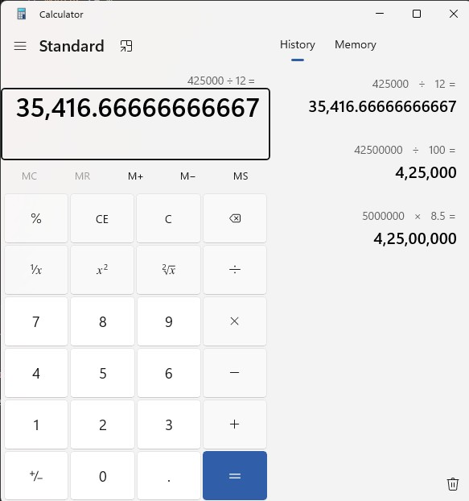
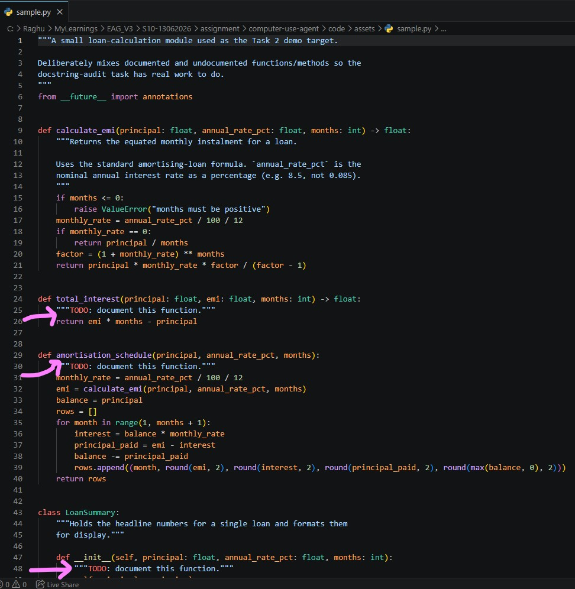
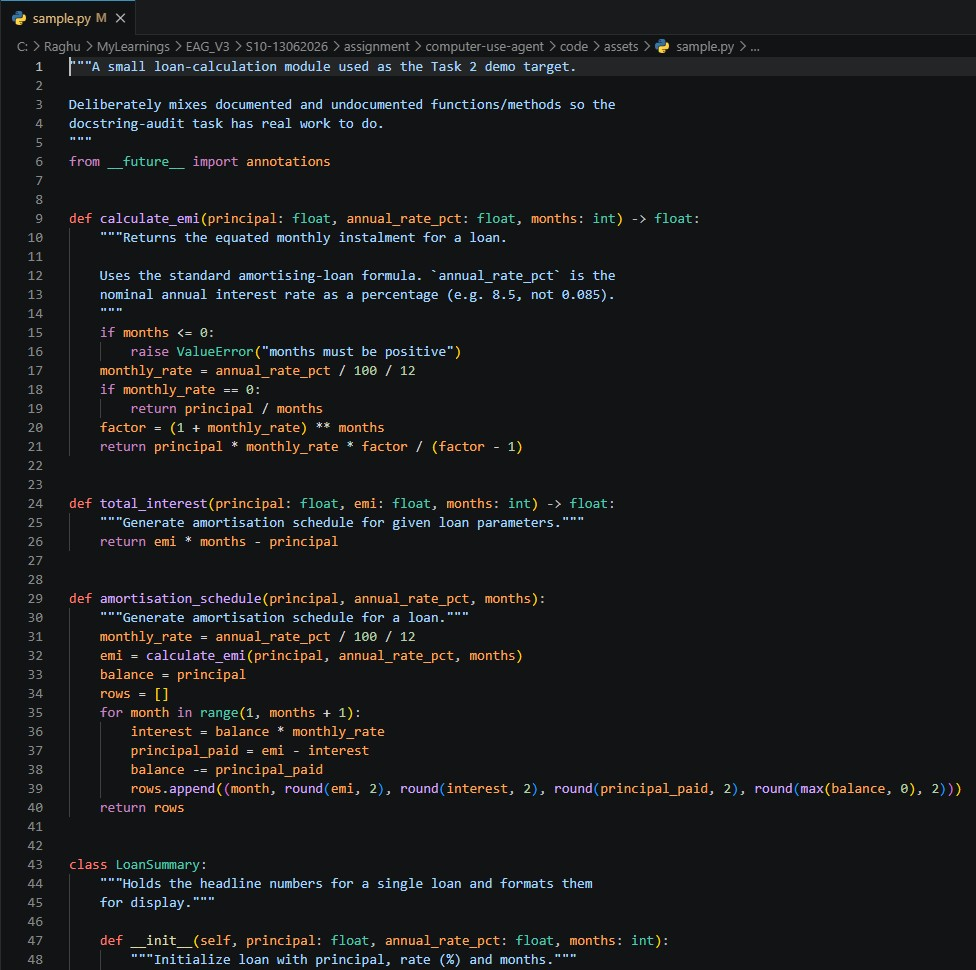

# computer-use-agent

A computer-use skill that drives real desktop applications on Windows
through `cua-driver`, using a free-tier multi-provider LLM gateway
(`llm_gatewayV9`, bundled in this repo) for every judgment and vision
call. No paid APIs, no third-party agentic frameworks.

## 1. Repo layout

```
computer-use-agent/
├── llm_gatewayV9/      bundled LLM gateway (FastAPI service, port 8109)
└── code/
    ├── gateway.py        bridge: auto-starts the gateway, exposes LLM + vision()
    ├── config.py         paths, ports, per-task constants, .env loading
    ├── driver.py         cua-driver CLI wrapper
    ├── planner.py        Layer: goal decomposition
    ├── perception.py     Layer: perception interpretation
    ├── action.py         Layer: action sequencing (scan-act-verify)
    ├── recovery.py       Layer: error recovery
    ├── vision.py         Layer: vision fallback
    ├── recorder.py        start_recording/stop_recording wrapper
    ├── task1_calculator.py
    ├── task2_vscode.py
    ├── task3_mspaint.py
    ├── run_all.py         CLI entrypoint
    └── assets/            sample.py, analyze.py for the Task 2 demo
```

See `HANDOFF.md` for the things worth verifying before/while running this
on a real machine, and for picking the project back up in Claude Code.

## 2. Setup

```bash
cp .env.example .env        # fill in at least one LLM provider key

# Install cua-driver (Windows)
irm https://raw.githubusercontent.com/trycua/cua/main/libs/cua-driver/scripts/install.ps1 | iex
# Opens new shell with cua-driver on PATH. Start daemon before running tasks:
cua-driver serve            # keep this running (or it auto-starts at logon)

# Install Python dependencies with uv (https://docs.astral.sh/uv/)
cd code
uv sync                     # creates .venv and installs from pyproject.toml

# The gateway auto-starts on first use; if you want to install it separately:
cd ../llm_gatewayV9
uv sync                     # uses pyproject.toml already present there

# Run tasks
cd ../code
uv run python run_all.py           # runs all three tasks, or:
uv run python run_all.py calculator
uv run python run_all.py vscode
uv run python run_all.py mspaint
```

The gateway starts itself on first use (`gateway.ensure_gateway()`); you
don't need to run it separately. `cua-driver` itself must already be
installed and on PATH — this project only wraps it.

## 3. Architecture: the five layers

`cua-driver` gives perception and action -- launching apps, walking
accessibility trees, synthesising clicks/keystrokes, screenshots,
recording. It does **not** plan, interpret what it perceives, recover
from errors, or do vision. Those five layers are what this project
builds on top, each in its own module so the cascade discipline is
visible rather than folded into the three task scripts:

| Layer | Module | What it does here |
|---|---|---|
| Goal decomposition | `planner.py` | Maps a goal to ordered subgoals. All three tasks use the free path (a known, fixed subgoal list, zero LLM cost) since the steps are well understood at write-time; the LLM-decompose path exists for free-text goals. |
| Perception interpretation | `perception.py` | `extract_direct()` reads values straight out of AX markdown (zero LLM). `judge_action()` is the Layer-2b workhorse: AX markdown + goal -> a cheap text model -> a structured `{"verdict": "act", "action": {...}}` or `{"verdict": "escalate", ...}`. |
| Action sequencing | `action.py` | `scan()` / `act()` / `verify()`, kept as separate calls on purpose so a stale `element_index` from a previous turn can never be reused -- the two invariants from the driver guide (scan before any indexed action; re-scan after every state-changing one) are enforced structurally, not by convention. |
| Error recovery | `recovery.py` | The "traps that look the same" from the driver guide: a cache-miss/empty-tree after launch gets one recovery attempt (bring-to-front, sleep, re-scan); a target that's *supposed* to have an empty tree (a canvas) raises immediately instead of retrying pointlessly. |
| Vision fallback | `vision.py` | Screenshot -> optional set-of-marks -> the gateway's typed `/v1/vision` endpoint -> a parsed verdict. Roughly 10x the per-turn cost of Layer 2b, used only where nothing else can do the job. |

This is a distinct concept from the *cost cascade* inside an individual
perception call (Layer 1 extract / Layer 2a deterministic / Layer 2b
AX+LLM / Layer 3 vision) -- the five layers above are the architecture;
the cost cascade is a decision made *within* the perception-interpretation
and vision-fallback layers about which is cheapest for a given step.

### 3.1 Architecture diagram

```
                      COMPUTER-USE AGENT — 5-LAYER CASCADE
                      ─────────────────────────────────────

  [GOAL]
    │
    ▼
  ┌──────────────────────────────────────────────────────────────────┐
  │  LAYER 1 · Goal Decomposition          (planner.py)              │
  │  Maps a free-text goal to an ordered subgoal list.               │
  │  LLM cost: ZERO (subgoals are fixed at write-time for all 3      │
  │  tasks; the LLM-decompose path exists for free-text goals).      │
  └─────────────────────────────┬────────────────────────────────────┘
                                │ ordered subgoal list
                                ▼
  ┌──────────────────────────────────────────────────────────────────┐
  │  LAYER 2 · Perception Interpretation   (perception.py)           │
  │                                                                  │
  │  ┌─────────────────────────┐  ┌────────────────────────────────┐ │
  │  │ 2a — AX tree            │  │ 2b — AX tree + LLM judgment    │ │
  │  │ extract_direct()        │  │ judge_action()                 │ │
  │  │ ZERO LLM cost           │  │ Cheap text model via gateway   │ │
  │  │ Task 1: read display    │  │ Task 2: draft docstrings       │ │
  │  │ Task 3: find star btn   │  │ Task 3: (save dialog, if AX)   │ │
  │  └─────────────────────────┘  └────────────────────────────────┘ │
  └─────────────────────────────┬────────────────────────────────────┘
                                │ action spec (element_index or key)
                                ▼
  ┌──────────────────────────────────────────────────────────────────┐
  │  LAYER 3 · Action Sequencing           (action.py)               │
  │  scan() → act() → verify()                                       │
  │  Invariant: never reuse a stale element_index; re-scan after     │
  │  every state-changing action. Enforced structurally.             │
  └───────────────────────┬──────────────────────────────────────────┘
                          │
             ┌────────────┴─────────────┐
             │                          │
             ▼                          ▼
  ┌─────────────────────┐   ┌──────────────────────────────────────┐
  │ LAYER 4 · Recovery  │   │ LAYER 5 · Vision Fallback            │
  │ (recovery.py)       │   │ (vision.py)                          │
  │                     │   │                                      │
  │ Empty AX tree →     │   │ Screenshot → gateway /v1/vision      │
  │ bring-to-front      │   │ → parsed structured verdict          │
  │ + re-scan once      │   │                                      │
  │                     │   │ ~10× cost of Layer 2b.               │
  │ Canvas empty →      │   │ Used ONLY where no other perception  │
  │ raise immediately   │   │ channel exists (canvas pixel check). │
  │ (expected, not bug) │   │ Task 3: confirms star was drawn.     │
  └─────────────────────┘   └──────────────────────────────────────┘

  COST CASCADE (per step, cheapest tried first):
    Layer 1 extract → Layer 2a AX → Layer 2b AX+LLM → Layer 3 vision
```

### 3.2 Task flow diagrams

**Task 1 — Calculator (zero LLM, zero vision)**

```
  Goal: compute 5000000*8.5/100/12 in Calculator
    │
    ├─ [L1] decompose → Launch / Type / Click = / Read display
    │
    ├─ [Action] launch calc.exe
    │
    ├─ [L2a] scan AX tree → btn_map {title → element_index}  (NO LLM)
    │         found ~24 buttons; "five", "multiply by", "eight", ...
    │
    ├─ [Action] click buttons via UIA InvokePattern:
    │           5→0→0→0→0→0→0→×→8→.→5→÷→1→0→0→÷→1→2→=
    │
    ├─ [L1] extract_direct(AX, "Display is (.+)") → "35,416.66666666667"
    │         (NO LLM, NO vision — value read from accessibility tree)
    │
    └─ Result: 35,416.66666666667   [ZERO LLM calls, ZERO vision calls]
```

**Task 2 — VS Code (Electron / CDP path, Layer 2b)**

```
  Goal: add docstrings to all undocumented functions in sample.py
    │
    ├─ [L1] decompose → Launch VS Code / Confirm tab / Find stubs / Draft / Insert / Verify
    │
    ├─ [Action] subprocess.Popen(VSCODE_EXE, sample.py)  [stdout/stderr suppressed]
    │
    ├─ [Action] CDP page click on active tab (Electron path)
    │           Non-fatal if VS Code has no debug port (existing process)
    │
    ├─ [L1] AST walk of sample.py → detect 5 TODO-stub functions
    │         (extract_direct on the file's AST; NO LLM)
    │         found: total_interest, amortisation_schedule, __init__,
    │                total_payable, LoanSummary.total_interest
    │
    ├─ [L2b] LLM judgment × 5 → one docstring per function
    │         gateway routes to Gemini/Groq; max_tokens=1000
    │
    ├─ [Action] write 5 docstrings to sample.py (bottom→top to preserve line #s)
    │
    ├─ [Action] VS Code "Revert File" via Ctrl+Shift+P + clipboard paste
    │           (file visibly refreshes in editor)
    │
    ├─ [L1/Verify] re-parse AST → 0 stubs remaining; run analyze.py
    │
    └─ Result: documented 5/5 functions   [ZERO vision calls]
```

**Task 3 — MS Paint (genuine Layer 3 vision)**

```
  Goal: draw a five-pointed star in MS Paint and save it
    │
    ├─ [L1] decompose → Launch / Scan / Click shape / Drag / Vision verify / Save
    │
    ├─ [Action] launch mspaint.exe
    │
    ├─ [L2a] scan AX tree → "Five-point star" button at element_index=38  (NO LLM)
    │
    ├─ [Action] click shape button via UIA InvokePattern
    │           [stop_recording — recording hooks conflict with SendInput]
    │
    ├─ [Action] drag(dispatch="foreground"/SendInput) on canvas
    │           screen-absolute coords from list_windows bounds:
    │           (wx+685+80, wy+422+50) → (wx+685+471, wy+422+298)
    │           [start_recording resumed]
    │
    ├─ [Action] capture screenshot → mspaint_drawn.png
    │
    ├─ [L3 Vision] ask_vision(mspaint_drawn.png,
    │              "Does this show a five-pointed star?")
    │              → {looks_like_target: true, feedback: "star visible"}
    │              [Recovery: retry drag if false, bounded by PAINT_MAX_STEPS]
    │
    ├─ [Action] Ctrl+S (background PostMessage) → triggers Save As dialog
    │           PowerShell SendKeys → Ctrl+A, Ctrl+V (timestamped path), Enter
    │           [guaranteed copy: shutil.copy2(mspaint_drawn.png →
    │                            mspaint_output_DDMMYY_HHMM.png)]
    │
    └─ Result: vision=True, saved=True   [ONE vision call — only place needed]
```

## 4. The three tasks

### 4.1 Task 1 -- Calculator (zero vision, Layer 2a)

Computes `5000000*8.5/100/12` (an EMI-style calculation) via a fixed
sequence of `press_key` calls -- no LLM in the loop at all, since both
the goal and the keystrokes needed to reach it are known up front.
Verification reads the result straight out of the AX tree
(`Display is <value>`) -- Layer 1, not Layer 2b, because there's nothing
to judge, only a value to read and compare.

**Cascade decision:** this task exists specifically to prove the
zero-vision floor of the cascade -- the assignment's "at least one task
completes with zero vision calls" constraint.

### 4.2 Task 2 -- VS Code (Electron / CDP)

VS Code is Electron, so to the accessibility API it's a single opaque
`AXWebArea` -- there's no AX tree to scan no matter how the window is
activated. The fix is the documented one: relaunch with
`electron_debugging_port` and drive the DOM through the `page` tool.

This task reads `assets/sample.py`, finds functions missing docstrings
via a plain AST walk (Layer 1 -- the "tree" being filtered here is the
file's AST, not an AX tree, since none exists for Electron content), and
runs each through a cheap-LLM judgment call to draft a one-line
docstring. Insertion goes through VS Code's native "Go to Line" (Ctrl+G)
command plus typed keystrokes rather than CDP DOM scripting -- Monaco's
editor surface is virtualised and its internal selectors aren't
documented anywhere available here, so reaching into it with guessed CSS
selectors would be the fragile choice, not the careful one. The one
`page` call this task does make uses the exact selector from the driver
guide's own Electron example (`.tabs-container .tab.active`), kept
deliberately minimal rather than inventing further calls against an
unconfirmed action surface. After saving, `analyze.py` runs inside the
integrated terminal to independently re-check docstring coverage --
verification via a second, separate code path rather than trusting the
editor's own state.

**Cascade decision:** Electron is forced regardless of preference --
there is no AX-tree path available for this app at all.

### 4.3 Task 3 -- MS Paint (genuine Layer 3 vision)

The fully reasoned version of why this counts as vision is in the
docstring at the top of `task3_mspaint.py`; the short version: MS
Paint's toolbar is real, AX-readable Win32 UI, but nothing in any
accessibility API describes the *pixel content* of the canvas. There's
no AX node for "a star is drawn here." That's the actual reason vision
is mandatory for this task -- not an empty `element_count`, but the
simple fact that no other perception channel for canvas content was
ever going to exist.

The task scans the AX tree (Layer 2a) to find and click Paint's
built-in **Five-point star** shape button (AX element_index 38 in the
default toolbar layout). This is architecturally cleaner than computing
pentagram stroke geometry by hand -- the AX tree already encodes which
button arms the right tool. After clicking the shape button, the task
does NOT re-scan: calling `action.scan()` (UIA) immediately after
clicking a shape-tool button resets the shape selection in Windows 11
new Paint. Instead it proceeds directly to the drag.

Drawing uses `driver.drag(dispatch="foreground")` (the SendInput path),
not the default `dispatch="background"` (PostMessage). New Paint's
canvas is a XAML/WinUI control that silently drops PostMessage mouse
events. The foreground drag takes screen-absolute coordinates computed
from the live window bounds returned by `list_windows`. The trajectory
recorder is paused around the drag step because cua-driver's recording
hooks interfere with foreground SendInput on Windows.

Vision is reserved for afterward: a screenshot of the drawn result goes
to the gateway's `/v1/vision` endpoint with a yes/no-plus-feedback
schema, asking whether the canvas actually shows a star. One corrective
redraw pass happens if not, bounded by `PAINT_MAX_STEPS`.

Saving switches back to Layer 2b deliberately: the Save-As dialog is a
native Win32 dialog, fully AX-readable, so `perception.judge_action()`
drives it rather than continuing to use vision -- a direct illustration
of choosing the cheapest layer that can do the job, decided per step,
not per task.

**Cascade decision:** this is the assignment's required vision task, and
the one place where escalating to vision isn't a fallback from a failed
AX read -- it's the only channel that was ever available.

## 5. Cost-ledger tagging

All gateway calls use `agent="computer"`, matching the driver guide's own
convention (`The cost ledger tags calls under agent: computer`), with
`session=<task name>` differentiating each task's calls for ledger
scoping. No provider is pinned in code — if you want deterministic
routing, edit `llm_gatewayV9/agent_routing.yaml`, not the Python.

At the end of every task run, the app automatically queries the gateway's
`/v1/cost/by_agent` endpoint and prints **turn count, token count, and
estimated cost** to the console. Task 1 (zero LLM) says so explicitly;
Task 2 shows one row per function documented; Task 3 shows the vision call.
When running all tasks together a grand total is printed at the end:

```
============================================================
  GRAND TOTAL — LLM Cost Across All Tasks
============================================================
  [cost] session='task1_calculator': no LLM calls recorded (deterministic path, zero LLM cost)
  ── LLM cost ledger ── session='task2_vscode'
    [computer]  cerebras/?  in=3,549  out=6,854 tok  $0.00520  latency=0ms
    [computer]  gemini/?  in=436  out=80 tok  $0.00000  latency=0ms
  TOTAL: 2 LLM turn(s)  |  3,985 in + 6,934 out tokens  |  $0.00520
  ── LLM cost ledger ── session='task3_mspaint'
    [computer]  gemini/?  in=4,474  out=517 tok  $0.00000  latency=0ms
  TOTAL: 1 LLM turn(s)  |  4,474 in + 517 out tokens  |  $0.00000
```

Task 1 records zero LLM cost — the Calculator path is fully deterministic (Layer 2a AX reads only).
Task 2 shows $0.00520 because Layer 2b drafts docstrings via Cerebras (a paid provider); the
high output-token count reflects Cerebras' chain-of-thought reasoning tokens bundled in the
response. Task 3 uses Gemini free-tier for the vision verification call, so $0.00000.
The gateway's `pricing.py` returns $0 for free-tier providers; switch to a paid tier and
the dollar figure will reflect actual cost.

## 6. Evidence and artifacts

Every run produces a `runs/<task>_<timestamp>/` trajectory directory via
`cua-driver`'s `start_recording`/`stop_recording`. Each trajectory contains
JSON event logs (`events.jsonl`) covering all tool calls made during that run.

| Artifact | Location | Description |
|---|---|---|
| Star drawing | `code/assets/mspaint_drawn.png` | Screenshot of the drawn canvas captured before save; used as the vision-verify image |
| Timestamped save | `code/assets/mspaint_output_DDMMYY_HHMM.png` | Unique output file per run (name includes run timestamp so no overwrite collisions) |
| Docstring audit | `code/assets/docstring_audit.md` | Markdown report of which functions were documented, generated after each Task 2 run |
| sample.py (baseline) | `code/assets/sample.py` | Committed with TODO-stub docstrings; `git checkout code/assets/sample.py` restores undocumented state |
| Trajectory logs | `runs/task1_calculator_*/` `runs/task2_vscode_*/` `runs/task3_mspaint_*/` | JSON event streams from cua-driver recording |

### 6.1 Layer visibility in console output

Each task prints its active architecture layer at every step so the cascade
discipline is visible at runtime without reading the source code:

**Task 1 — Calculator (zero LLM, zero vision)**

```
[task1] LAYER 1 — Goal decomposition: compute 5000000*8.5/100/12
[task1] Action — launching Calculator
[task1] Launch OK — pid=6892, window_id=2361742
[task1] LAYER 2a — Perception/AX: scanning button layout
[task1] LAYER 2a — found 32 buttons in AX tree (no LLM needed)
[task1] Action — entering expression via element_index clicks (UIA InvokePattern)
[task1] LAYER 1 — Perception/extract: reading display value from AX tree (zero LLM)
[task1] LAYER 1 — Vision fallback: NOT USED (result read directly from AX tree)
[task1] 5000000*8.5/100/12 = 35,416.66666666667
  [cost] session='task1_calculator': no LLM calls recorded (deterministic path, zero LLM cost)
```

**Task 2 — VS Code (Electron CDP + Layer 2b, 5 LLM calls)**

```
[task2] LAYER 1 — Goal decomposition: audit and document sample.py in VS Code
[task2] Action — launching VS Code with sample.py
[task2] Launch OK — VS Code visible, pid=26924, window_id=5311316
[task2] Action — page click_element on active tab via CDP (Electron path)
[task2] LAYER 2a — page click_element succeeded (UIA/IAccessible2 path)
[task2] LAYER 1 — Perception/AST: parsing sample.py for undocumented/placeholder functions
[task2] LAYER 1 — found 5 functions needing docstrings: total_interest, amortisation_schedule,
         __init__, total_payable, total_interest
[task2] LAYER 2b — LLM judgment: drafting docstrings (one LLM call per function)
[task2] LAYER 2b — calling LLM for: total_interest...
[task2] LAYER 2b — total_interest → """Generate amortisation schedule for a loan."""
[task2] LAYER 2b — calling LLM for: amortisation_schedule...
[task2] LAYER 2b — amortisation_schedule → """Generate amortisation schedule for a loan."""
[task2] LAYER 2b — calling LLM for: __init__...
[task2] LAYER 2b — __init__ → """Initialize loan with principal, rate, months and compute EMI."""
[task2] LAYER 2b — calling LLM for: total_payable...
[task2] LAYER 2b — total_payable → """Calculate total interest over the loan period."""
[task2] LAYER 2b — calling LLM for: total_interest...
[task2] LAYER 2b — total_interest → """Calculate total interest from principal, EMI, and months."""
[task2] Action — writing 5 docstrings to sample.py
[task2] Action — file written; triggering VS Code 'Revert File' to refresh editor
[task2] Recovery/Verify — running analyze.py to confirm AST coverage
[task2] LAYER 1 — Perception/AST verify: re-parsing sample.py to count remaining stubs
[task2] LAYER 1 — verification: 5/5 functions documented (0 remaining)
[task2] LAYER 1 — Vision fallback: NOT USED (AST parse is sufficient for text verification)
[task2] documented 5/5 functions; audit written to code/assets/docstring_audit.md
  ── LLM cost ledger ── session='task2_vscode'
    [computer]  cerebras/?  in=7,513  out=13,781 tok  $0.01065  latency=0ms
    [computer]  gemini/?  in=436  out=80 tok  $0.00000  latency=0ms
  TOTAL: 2 LLM turn(s)  |  7,949 in + 13,861 out tokens  |  $0.01065
```

**Task 3 — MS Paint (Layer 3 vision)**

```
[task3] LAYER 1 — Goal decomposition: draw a 5-pointed star in MS Paint
[task3] Output artifact: mspaint_output_200626_0041.png
[task3] Action — launching MS Paint
[task3] Launch OK — pid=27812, window_id=987622
[task3] LAYER 2a — Perception/AX: scanning toolbar for shape buttons (no LLM)
[task3] LAYER 2a — found 'Five-point star' at element_index=38
[task3] Action — clicking shape tool via UIA InvokePattern (element_index=38)
[task3] Action — dragging on canvas via foreground/SendInput: (765,472)→(1156,720)
[task3] Action — capturing screenshot for vision verification
[task3] LAYER 3 — Vision: verifying drawn result (LLM vision call)
[task3] LAYER 3 — vision verdict: True (feedback: Yes, a 5-pointed star is clearly drawn on the canvas in the image.)
[task3] Action — saving: Ctrl+S + PowerShell SendKeys for dialog, then guaranteed copy
[task3] LAYER 3 — Vision fallback: USED (canvas pixel content not AX-readable)
[task3] drew a 5-pointed star, vision verdict: True, saved=True, path=mspaint_output_200626_0041.png
  ── LLM cost ledger ── session='task3_mspaint'
    [computer]  gemini/?  in=4,474  out=517 tok  $0.00000  latency=0ms
  TOTAL: 1 LLM turn(s)  |  4,474 in + 517 out tokens  |  $0.00000
```

**Results summary**

```
============================================================
  RESULTS SUMMARY
============================================================
  task1_calculator: result=35,416.66666666667
  task2_vscode: documented=5/5
  task3_mspaint: vision=True  save_path=mspaint_output_200626_0041.png
```

### 6.2 Screenshots

> Replace each placeholder below with a markdown image after your next run.

**Task 1 — Calculator (showing 35,416.67 result)**



---

**Task 2 — VS Code (showing sample.py with docstrings added)**

#### Before


#### After



---

**Task 3 — MS Paint (showing five-pointed star drawn on canvas)**

*[ Paste your MS Paint screenshot here ]*

The `mspaint_drawn.png` artifact (saved to `code/assets/`) is the exact image
the vision model inspected to confirm the star was drawn successfully.

---

## 7. Runtime findings (Windows 11, cua-driver v0.5.7)

All three tasks have been run and verified on the target Windows 11
machine. The issues below were encountered and fixed during those runs.

- **`launch_app` returns a stub pid** for Windows 11 Store apps
  (Calculator, Paint). The stub exits immediately; `find_window_for_pid`
  returns None. `driver.py` falls back to a `find_window_by_title`
  search, which correctly picks up the real host process.
- **`screenshot_png_b64` in JSON response** (not a file). cua-driver
  v0.5.7 on Windows returns the PNG encoded in the JSON body rather than
  writing `screenshot_out_file`. `driver.screenshot()` decodes and writes
  the file itself.
- **`drag()` parameter names** are `from_x/from_y/to_x/to_y` in the CLI
  (not `x1/y1/x2/y2`). Fixed in `driver.drag()`.
- **New Paint canvas drops PostMessage** mouse events (XAML/WinUI
  input model). `dispatch="foreground"` (SendInput) is required.
- **`dispatch="foreground"` uses screen-absolute coordinates**, not the
  screenshot-space coordinates that the background path uses.
- **UIA scan resets Paint shape selection.** Calling `action.scan()`
  after clicking a shape-tool button de-selects the tool. Task 3 skips
  the post-click re-scan and proceeds directly to drag.
- **`start_recording()` blocks foreground drag.** cua-driver's trajectory
  recording hooks intercept SendInput events. Task 3 calls
  `stop_recording()` before the draw drag and `start_recording()` after.
- **The `page` tool's `click_element` action (not `"click"`)** is the
  correct action name. `click_element` uses `execute_javascript` internally
  on Windows, which requires CDP (`--remote-debugging-port` on VS Code and
  `CUA_DRIVER_CDP_PORT=<port>` in cua-driver's environment at daemon start).
  One-time setup: kill `cua-driver.exe`, set `$env:CUA_DRIVER_CDP_PORT="9222"`,
  then restart (`cua-driver serve`). VS Code must be closed before running
  so it starts fresh with `--remote-debugging-port=9222`.
- **Windows 11 app windows open on the primary monitor.** `SetForegroundWindow`
  guarantees focus, not monitor placement. Apps cannot be moved to a secondary
  monitor programmatically without raw Win32 `SetWindowPos` calls (not exposed
  by cua-driver). This is a hard Windows limitation, not a bug.

## 8. Windows 11 notes

Quick-reference for issues specific to running on Windows 11 with cua-driver v0.5.7:

- **Calculator and Paint** are packaged Store apps. `launch_app(name=...)` resolves
  them via `shell:AppsFolder` and returns a stub pid that immediately redirects to
  the real process. `driver.py` handles this automatically by falling back to a
  title-based window search if the initial pid lookup yields no window.
- **`press_key` / `type_text` do not reach UWP apps** (Win11 Calculator, Win11 Paint)
  — these tools use PostMessage which UWP's XAML input stack ignores. Task 1 clicks
  Calculator buttons via UIA InvokePattern (element_index) instead.
- **`electron_debugging_port` is a no-op** in cua-driver on Windows. Task 2 launches
  VS Code directly via `subprocess.Popen`, bypassing the `launch_app` tool for this flag.
- **cua-driver screenshot returns `screenshot_png_b64`** in the JSON response body
  instead of writing to `screenshot_out_file` on Windows. `driver.screenshot()`
  decodes and writes the file itself.
- **`drag()` uses `from_x/from_y/to_x/to_y`** (not `x1/y1/x2/y2`) in cua-driver v0.5.7.
- **New Paint canvas is a XAML/WinUI control** that ignores PostMessage mouse events.
  `drag(dispatch="foreground")` (SendInput path) is required to draw on the canvas.
- **`dispatch="foreground"` takes screen-absolute coordinates**, not screenshot-space
  coordinates. For a 1920×1020 maximised Paint window at (0,0), the default canvas
  occupies screen pixels approximately (685, 422)–(1236, 770).
- **`start_recording()` hooks interfere with foreground drag.** Task 3 calls
  `stop_recording()` before the draw drag and `start_recording()` after so the
  trajectory is paused only for that single step.
- **Resetting sample.py between runs:** after Task 2 runs, `sample.py` on disk has
  real docstrings. Run `git checkout code/assets/sample.py` to restore the
  TODO-stub baseline so the next Task 2 run has real work to do.
